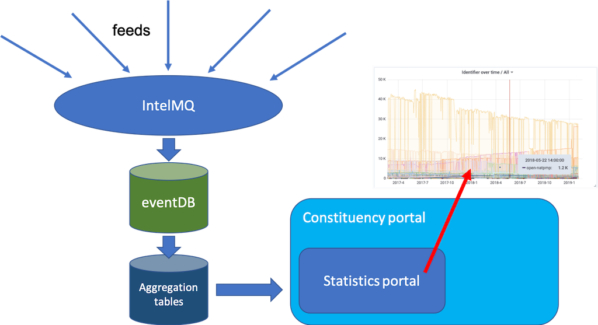

# Stats portal

The stats portal is a component in the certtools series. It connectes to the [eventDB](https://github.com/certtools/intelmq/blob/develop/intelmq/bin/intelmq_psql_initdb.py) (the database of all incident events which got processed by IntelMQ). The following picture explains the place of the stats-portal within the certtools components:

The stats portal is the presentation layer for the aggregation tables.
However, this code repository also contains the scripts to create the aggregation tables on periodic basis (for example via cron-jobs).

# Overview of this source code repository

This repo contains two parts:

  1. the [code](src/) to aggregate the eventDB  (creating aggregation tables)
  2. the [Grafana dashboard](src/grafana) which allows you to connect to the aggregation tables

# How to install

## Aggregation tables

Take a look at the [cronjob example](src/crontab) and run the shell scripts on the eventDB server.
The cron job creates aggregation tables, dumps them, pushes them to the server which will host the aggregation tables, loads them into postgresql there, transforms them to a timescaleDB format and cleans up some permissions. If you want to read the source code of this, please start by reading the (trivial) [make_all.sh](src/make_all.sh)

Assumptions:

We will call the host serving the aggregation tables "stats server".
We will call the host doing the aggregation tables "eventDB server".

The stats server creates the visual graphs via Grafana which pulls its data from the (timescale) aggregation tables.
Please note that it assumes a postgresql user "statsro" on the stats server (Grafana needs this)
Furthermore, we assume an (unix) ssh user "stats-sync" on both servers. ssh keys are used to push the data from the eventDB server to the stats server.

## Grafana dashboard

For the Grafana dashboard (on the stats server), please see the [README](src/grafana/README.md) in the grafana directory.

# General topics

## How to count correctly?

Alas, this question is anything but trivial. 
First, let's settle on a couple of definitions:

* **Measurement**: some observation of the Internet which results in multiple events. Measurements usually are [internet-wide scans](https://en.wikipedia.org/wiki/Port_scanner) or [sinkholes](https://en.wikipedia.org/wiki/DNS_sinkhole) of botnets or [honeypot](https://en.wikipedia.org/wiki/Honeypot_(computing)) events.
* **Feed**:  some data feed usually consisting of usually multiple rows ("events") which **must** always contain a time stamp (with time zone) and an IP address or a hostname / url.
* **Event**: a row in the feed.
* **EventDB**: the pre-processed (via IntelMQ or some other Extract Transform Load (ETL) tool) events are stored in a database, the eventDB.
* **Aggregation**: the events in the EventDB are grouped by some criteria and counted. 
* **Constituency portal**: a database ("contactDB") of a CERTs constituency. Usually contains contact information (email addresses, PGP keys, etc) for the constituency's security team. But often also contains relevant network information ("net objects") such as ASN, netblocks etc. Given the netobjects, each network operator can gain insight into his/her statistics for a specific ASN or some netblocks.
* **ASN**: Autonomous System Number. See [wikipedia:ASN](https://en.wikipedia.org/wiki/Autonomous_system_(Internet))

Now that we defined some terms, we can discuss how to count correctly, in other words: how to aggregate events properly. First of all, there is no "correct". We can only argue that certain ways of counting make more sense than others for specific questions. Secondly, the internet is a dynamic space. Effects such as [dynamic IP addresses](https://en.wikipedia.org/wiki/IP_address#Dynamic_IP) or [NAT](https://en.wikipedia.org/wiki/Network_address_translation) complicate the any measurement. Next to NAT and dynamic IPs, we also have the effect that answers to a measurement might be faked (especially with UDP based scans), packets might be dropped (for example with high scanning speeds) or the effect which is to be measured changes state during the measurement (a server gets turned off, a firewall rule triggers on the scan, etc.)
So, in other words: measuring is hard. We always must keep in mind that the underlying data of the measurement might be biased or skewed somehow. However, most of the time, a national CERT will take the data feeds by feed providers (such as shadowserver) and simply treat it as indication (a possibility) of an event and pass it on to the network operator as a hint that something might be wrong. So, in a sense, the feed is treated as ground truth from the national CERT perspective.

Understanding and aggregating the measurement is the second hard problem which is directly connected with the way we pose a question to the measurement data set (the eventDB).

In our case, we are mostly interested in the following questions:

* what are the trends over time for:
  * malware infections
  * types of problems ([classification.taxonomy](https://www.enisa.europa.eu/publications/reference-incident-classification-taxonomy), classification.type, classification.identifier)
  * involved applications and protocols (for example UDP amplifiers)
  * specific ASNs and network operators (how well is a network operator cleaning up his part of the Internet)
  * feed providers (internal metric): are we receiving a a constant feed or are there big variations within a feed provider?
  * number of events per day (overall)
  * number of unique (distinct) IP addresses 

Use cases
-----------

As can be seen above, one can vary the time interval (we will settle on one day), the way of counting (do we count number of events or number of distinct IP addresses?). 
Given the assumption that we take the feed provider's data as ground truth, we will try to answer the following questions:

### Internal view (national CSIRT's overview page)

* how many events per day per taxonomy (taxonomy, type, identifier) exist?
* how many events are we getting per ASN per feed provider?
* what are the top-N ASNs per taxonomy (taxonomy, type, identifier)?
* where (ASN) are we seeing steady increases of problems (versus the regularl slow decline of issues)?
* what are the top-N problems in our country?

### Network operator's perspective

* How many events per day are there in my ASN? (--> trendline)
* How many events per day per taxonomy are there in my ASN? (--> trendline)
* If settling on specific taxonomy, how many types are there in my ASN? (--> trendline)
* What malware infections exist in my ASN? (trendline)
* What are the trends for vulnerabilities in my ASN? (trendline)

These questions are being answered by the stats portal.

  
Funded by
=========

This project was partially funded by the CEF framework

