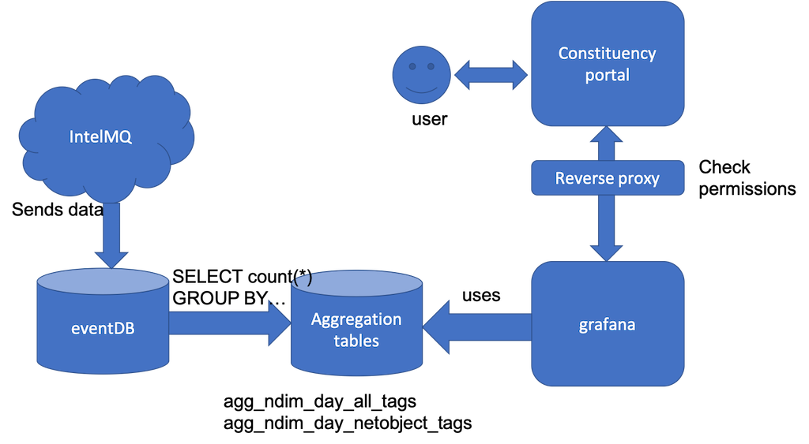

# Server backend side

We assume that the server backend hosts a postgreql eventDB. See [the corresponding IntelMQ output bot](https://github.com/certtools/intelmq/tree/develop/intelmq/bots/outputs/postgresql) as well as the scripts to [create the eventDB structure](https://github.com/certtools/intelmq/blob/develop/intelmq/bin/intelmq_psql_initdb.py).

From the eventDB, we can create aggregation tables and copy them over to a separate server.
There, we convert the aggregation tables to [timescaleDB](https://www.timescale.com/) in order to speed up time window based searches.
Have a look at the [make_all.sh](make_all.sh) script.

The constituency portal source code resides in [this repo](https://github.com/certat/do-portal)

The whole process can be seen in the architecture sketch below:

